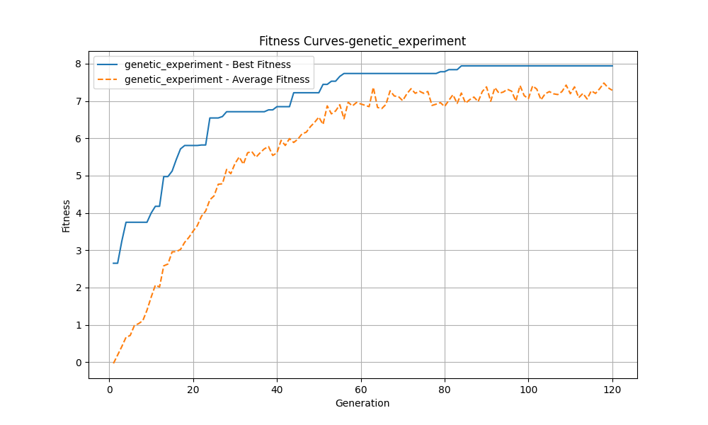
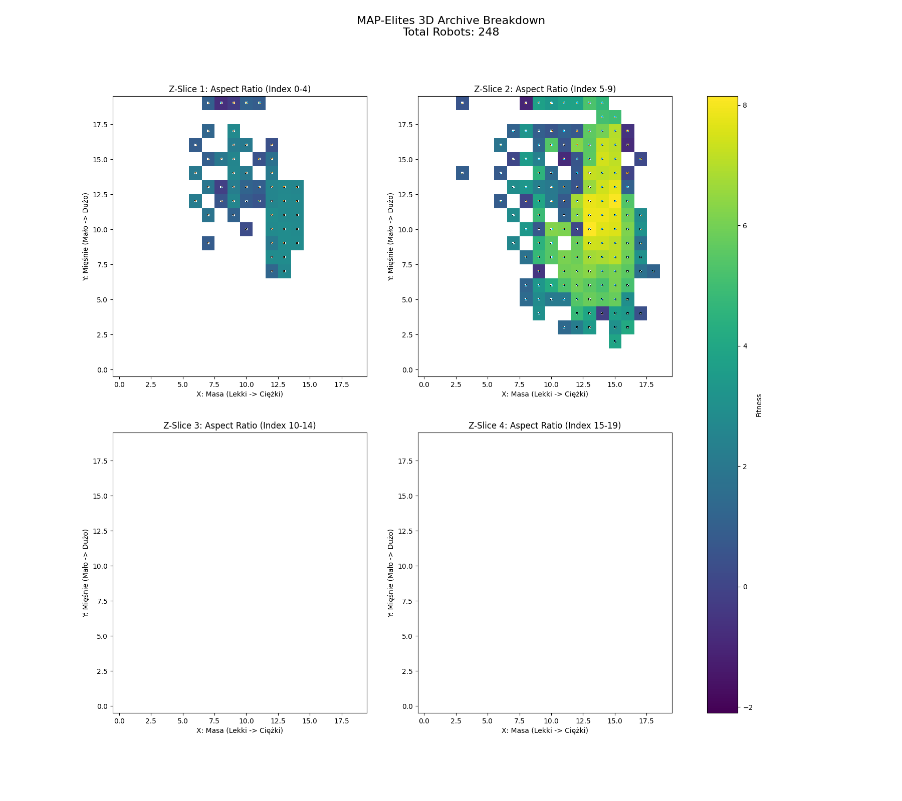
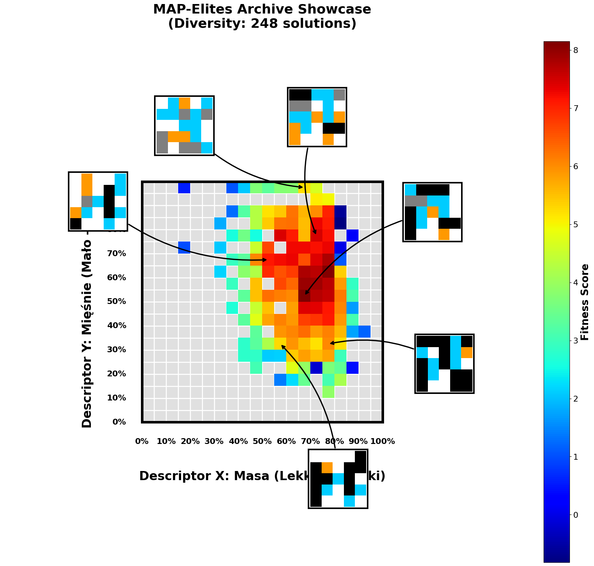
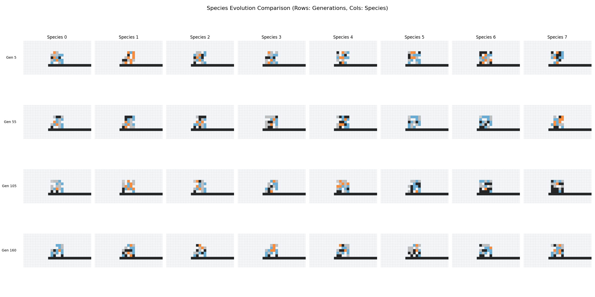

# Evolutionary Robotics with EvoGym

This project explores the evolution of soft robots using the [EvoGym](https://github.com/EvolutionGym/evogym) simulation environment. It implements and compares different evolutionary algorithms to optimize robot morphology and control for locomotion tasks.

## Algorithms Implemented

The project features three distinct evolutionary strategies:

1.  **Standard Genetic Algorithm (GA)**: A baseline evolutionary approach using tournament selection, crossover, and mutation to evolve robot structures.
2.  **Species-based Genetic Algorithm**: Incorporates speciation mechanisms to maintain population diversity, allowing for the exploration of different robot structures.
3.  **MAP-Elites (Multi-dimensional Archive of Phenotypic Elites)**: A quality-diversity algorithm that searches for high-performing solutions across a defined feature space (e.g., robot size, density, or other morphological descriptors), producing a diverse set of capable robots.

## Setup

1.  Ensure you have Python 3.10 installed.
2.  Install the required dependencies:

    ```bash
    pip install -r requirements.txt
    ```

    *Note: You may need to install `evogym` separately if some problems occur, please refer to the [EvoGym installation guide](https://github.com/EvolutionGym/evogym#installation) for platform-specific instructions.*

## Usage

### Running Experiments

To run a suite of experiments comparing the algorithms, execute:

```bash
python src/run_experiments.py
```

This script orchestrates the execution of the defined algorithms (GA, Species GA, MAP-Elites) and saves the results.

### Single Run & Visualization

For running a specific algorithm configuration or visualizing results (like the MAP-Elites showcase), you can use:

```bash
python src/main.py
```

This script is currently configured to run or visualize the MAP-Elites algorithm, showing the best evolved robots and heatmaps.

## Results

### Performance Comparison

Below is the comparison of fitness curves across the different experiments:


---

### 1. Genetic Experiment

**Evolution Progress:**


**Best Robot:**


**Fitness Curve:**


---

### 2. MAP-Elites Experiment

**Evolution Progress:**


**Best Robot:**


**Heatmaps:**
*Diversity of evolved forms and their performance.*

| Advanced Heatmap | Robot Morphology Map |
| :---: | :---: |
|  |  |

---

### 3. Species Experiment

**Evolution Progress:**


**Best Robot:**


**Species Analysis:**

